<p align="center">
  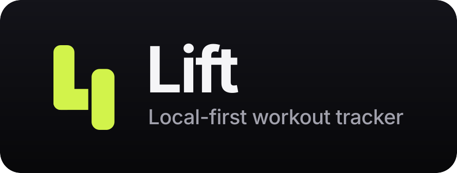
</p>

<p align="center">
  <a href="https://github.com/pawan67/lift/actions/workflows/android.yml">
    
  </a>
  <a href="LICENSE">
    
  </a>
  <a href="#self-hosting">
    
  </a>
</p>

A local-first workout tracker in the spirit of Hevy. Everything works offline;
an account is optional and only adds backup and cross-device sync — and the
server behind that sync is this same repository, so you can run your own
instead of trusting someone else's.

## Screens

| Home | Logging a session | Calendar |
| :--: | :--: | :--: |
| 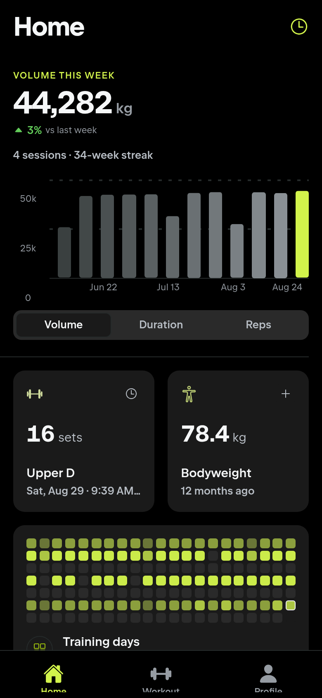 | 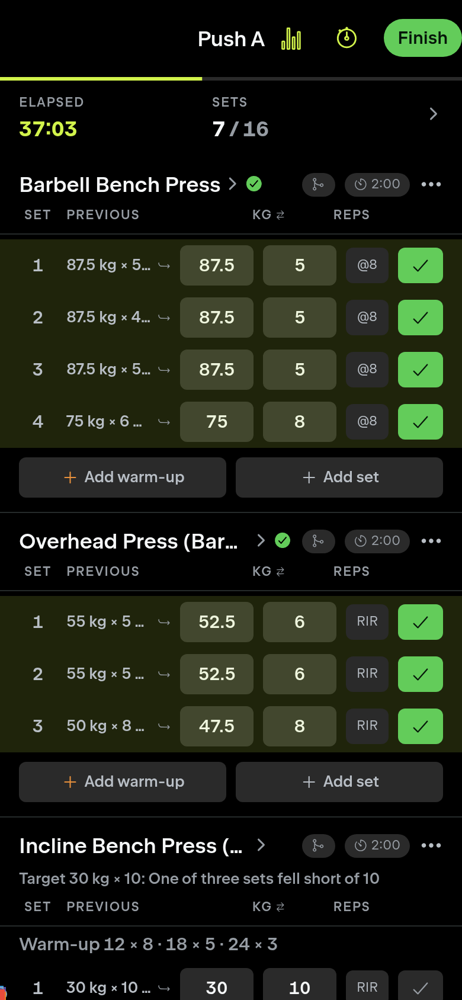 | 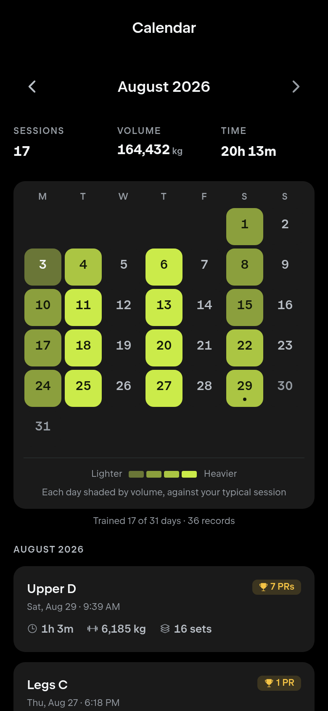 |
| **Statistics** | **Personal records** | **Exercise detail** |
| 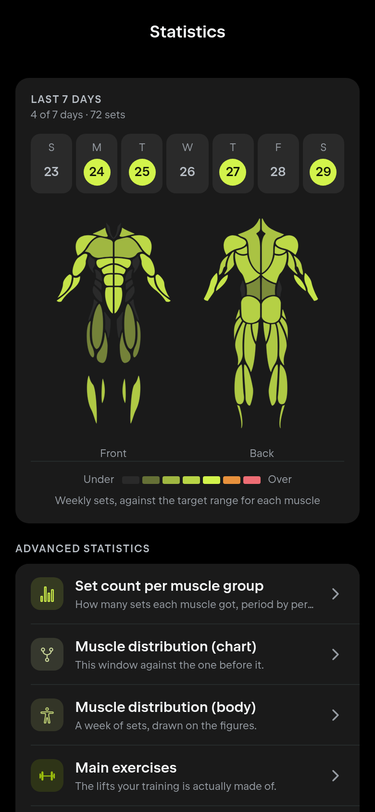 | 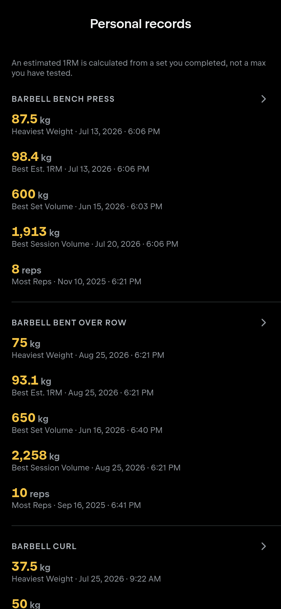 | 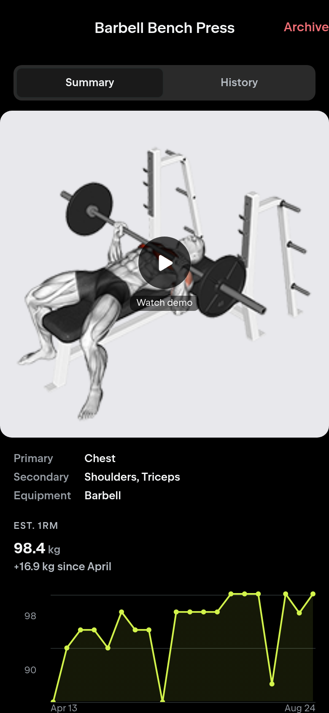 |
| **Body** | **Monthly report** | **Supersets** |
| 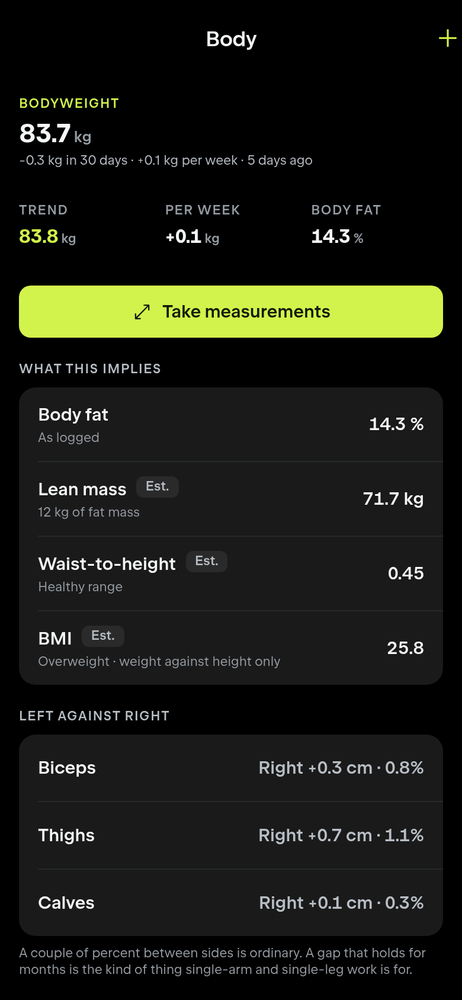 | 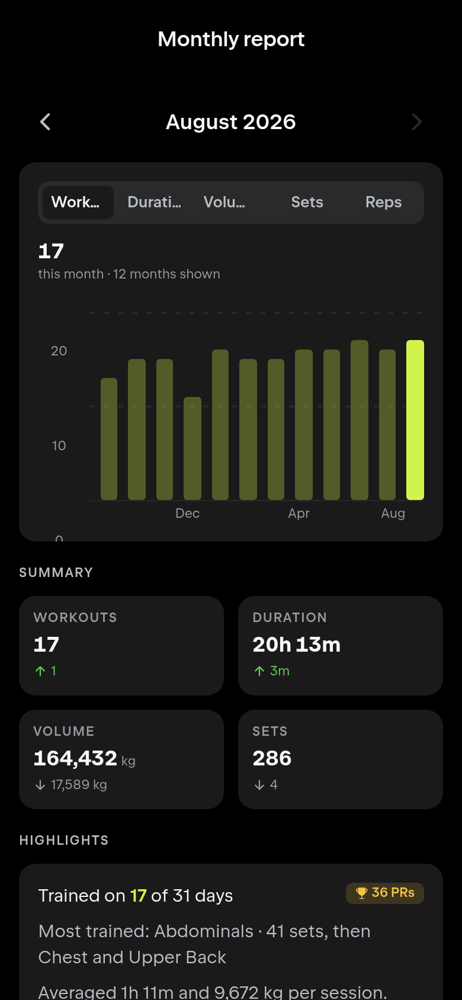 | 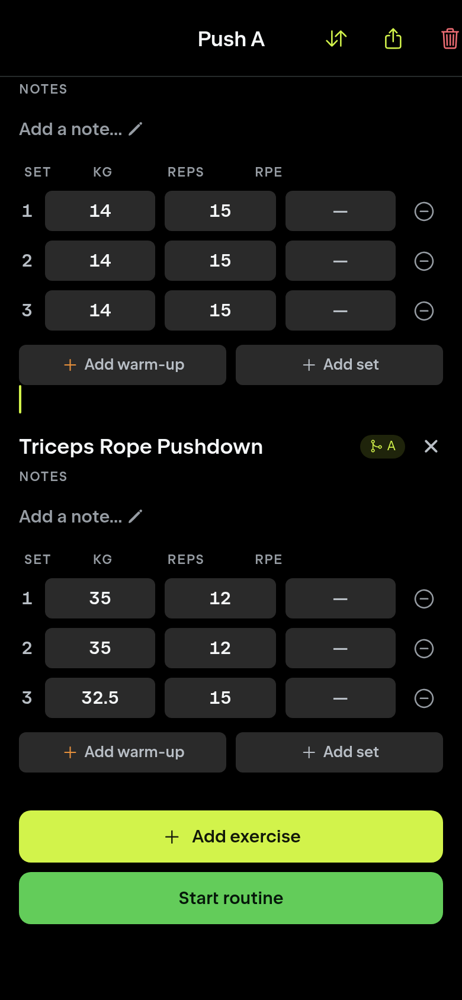 |

The same app, same code and same database, laid out for a window:

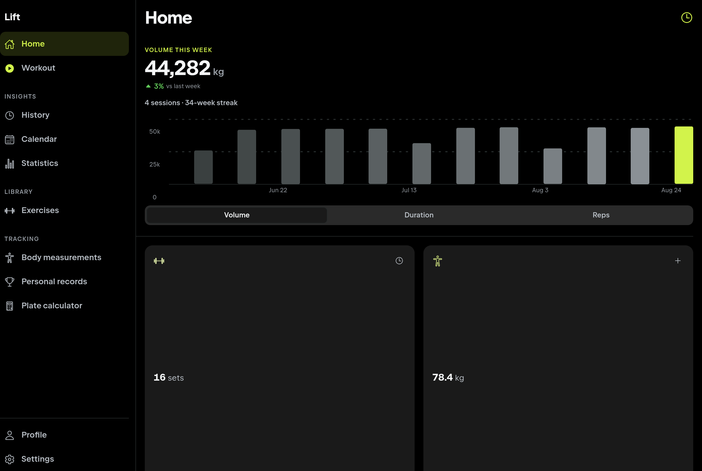

Every figure above is one generated year of training rather than anyone's real
log: `node scripts/screenshots/capture.mjs` builds the year, feeds it in through
the app's own importer and retakes each image. The rest of the set, including
the routine list, the palette grid, the plate calculator and the home tab in
each of the eight palettes, is in [`screenshots/`](screenshots).

## Features

- **Local-first.** Every workout, PR and body-weight entry writes to a
  database on the device first. No account, no server, no connectivity
  required to use the app.
- **Sync is optional, and self-hostable.** The API is a small NestJS +
  Postgres service you can run yourself with Docker Compose — see
  [Self-hosting](#self-hosting) — instead of depending on a hosted one.
- **A rest timer that survives the app dying.** Backed by an Android
  foreground service, so the countdown in the notification shade stays live
  even if the app is killed mid-set. The bell at zero can ring on the phone's
  notification or alarm volume rather than its media volume, so it still
  reaches you with a pair of earbuds sitting on the bench.
- **Supersets**, prescribed in a routine or paired mid-session: tap the link
  chip on an exercise to join it to the one above or below, and the grouping
  carries from the routine into every session started from it.
- **Home screen widgets.** Two Android widgets: your routines, one tap from
  starting the session, and your last weigh-in, one tap from logging the next.
  Both follow the palette the app is on — see
  [Home screen widgets](#home-screen-widgets).
- **History, a workout calendar, and volume/PR analytics.**
- **Body tracking**, with estimated 1RM, BMI and body-fat figures.
- **An AI coach, off by default and on your own key.** The app tells you which
  muscles are under their weekly minimum without one: that figure is arithmetic
  over the volume landmarks and it works offline. Add an Anthropic or
  OpenAI-compatible key under Settings, AI coach, and the same screens will also
  say what to change, review a block of training in a conversation you can
  follow up on, and write a few sentences on the session you just finished.
  Requests go from the phone straight to the provider you pick, never through a
  Lift server, and the key is held in the device keychain rather than in your
  settings or your backups. Pointing the base URL at Ollama or LM Studio keeps
  the whole thing on your own machine. See [The AI coach](#the-ai-coach).
- **Nine palettes** — Nord, Gruvbox, Catppuccin and Solarized among them —
  each carried through to the Android launcher icon.
- **Ships as an APK**, not a store listing, with over-the-air JavaScript
  updates so most fixes reach the phone without a reinstall.

```
lift/
├── apps/mobile      Expo SDK 57 · React Native 0.86 · expo-router
├── apps/api         NestJS 11 · Postgres · better-auth
├── apps/landing     Next 16 · Tailwind v4 · the marketing page
└── packages/shared  domain logic: no React, no database, fully tested
```

## Install on Android

Download the APK from [the latest release](https://github.com/pawan67/lift/releases/latest)
and open it on the phone. Android will ask you to allow installs from your
browser the first time.

Builds are produced by [`.github/workflows/android.yml`](.github/workflows/android.yml):
push a `v*` tag to cut a release, or run the workflow by hand from the
Actions tab to get an APK as a build artifact.

Cut the version first, rather than editing the files by hand:

```bash
node scripts/release.mjs set 0.15.0   # or major/minor/patch
```

Six files carry the version and CI fails if they disagree. That command
rewrites all six and regenerates `CHANGELOG.md` from the commit log, which is
also where the release notes come from: `--generate-notes` derives them from
merged pull requests and this repository has none, so tags cut before this
existed have empty notes. `node scripts/release.mjs` on its own only checks.

Two things to know about the APK itself:

- **arm64-v8a only** by default, which covers any phone from the last decade.
  The workflow's `architectures` input builds the other ABIs if you need them.
- **Signed with the debug key** that Expo's prebuild template ships. That key
  is a fixed file in the template rather than something generated per machine,
  so CI-built and locally-built APKs share a signature and install over each
  other. It also means the APK is not publishable to the Play Store as-is.

Sync needs the API to be reachable from the phone. Set the `API_URL`
repository variable before building. A release build has no Metro server to
infer a host from, so it otherwise falls back to `localhost`, which on a phone
means the phone itself.

## Self-hosting

Everything sync depends on — the API, the web build, the landing page — is
in this repository and deploys with Docker. Nothing calls out to a service
you don't control.

`apps/api/Dockerfile` is a multi-stage build that runs unprivileged, applies
pending migrations before it starts listening, and carries a healthcheck that
round-trips to Postgres rather than returning a static 200.

On Dokploy:

1. Create a **Postgres** service and copy the connection URL it hands back.
2. Create a **Compose** application from this repository and set the compose
   path to `docker-compose.dokploy.yml`. That file defines the API, the web app
   and the landing page. The database is the service from step 1, not a
   container of its own.
3. Supply `DATABASE_URL` from step 1, `BETTER_AUTH_SECRET`, `BETTER_AUTH_URL`
   as the public `https://` address including scheme, `TRUSTED_ORIGINS`, which
   has to list `lift://` or the app cannot complete an OAuth round trip,
   `EXPO_PUBLIC_API_URL`, the API's public URL as the browser will call it, and
   `NEXT_PUBLIC_SITE_URL`, the landing page's own public URL. All six are
   required; the stack refuses to start without them rather than inventing
   defaults.
4. Add three domains, one per service:

   | Service   | Port   | What it is             |
   | --------- | ------ | ---------------------- |
   | `api`     | `3000` | sync server            |
   | `web`     | `80`   | the app in a browser   |
   | `landing` | `3000` | the marketing page     |

   `api` and `landing` both name port 3000 and do not clash: they are separate
   containers, and the number is the port inside each one.
5. Add the `web` domain's origin to `TRUSTED_ORIGINS`.
   `lift://,https://app.example.com`. Without it the browser can load the app
   and then fails every request it makes, which reads as a broken sign-in
   rather than as a missing setting. The **landing page's origin does not go in
   here**: it makes no request the API has to trust, and listing it widens what
   the API accepts for nothing.

`EXPO_PUBLIC_API_URL` is baked into the web bundle at build time, so moving the
API means redeploying the web app, not restarting it. `NEXT_PUBLIC_SITE_URL` is
the same kind of value for the landing page. It is what the social card's image
URL is resolved against, so a wrong one leaves the page looking perfect while
every share preview comes back blank. The phone builds are unaffected by any of
this; they carry their own copy, set when the APK is built.

The schema is created on first boot. A migration that fails takes the container
down with it instead of serving against a half-applied schema, so a broken
deploy is reported as broken rather than quietly answering 500s.

`TRUSTED_PROXIES` defaults to Docker's private ranges, which is what Traefik
sits in. It only needs setting if something else (a CDN, another proxy) ends
up in front, in which case rate limiting counts that hop as the caller until
its ranges are added.

Two things worth doing on day one: turn on scheduled database backups, and
verify a restore. This app holds people's multi-year training history.

## The AI coach

Off until you turn it on, and it stays useful when you don't.

**What works without a key.** `packages/shared/src/ai/advisor.ts` compares the
weekly set count per muscle against the MEV/MAV/MRV landmarks in
`landmarks.ts` and ranks whatever is outside its range. That is the card on the
home screen and under Statistics saying side delts got 4 sets a week against a
minimum of 10. It is arithmetic over data already on the device, it is unit
tested, and it runs on a plane.

**What a key adds.** The words, never the numbers. A model is handed the figures
above and asked where to put the sets, which routine to put them in, and what a
block of training looks like. The rule the whole feature is built on is that
logic owns every figure and the model owns only the prose: a model that arrives
at a slightly different set count is not a second opinion, it is a contradiction
of the screen next to it that the reader has no way to adjudicate. Each brief in
`packages/shared/src/ai/briefs.ts` says so explicitly.

Four surfaces use it: the coach chat (`/coach`, which still exports the prompt
for anyone who would rather paste it somewhere else), a summary on the finish
screen, the prescription half of the volume advisor, and a reading of the
statistics screens.

**Where the key goes.** Into the OS keychain via `expo-secure-store`, or
`localStorage` on the web build, through the same dual-target module the session
token uses and for the same reasons. It is not in `settings`, so it is not in a
backup, and it is never rendered back into a field.

**Providers.** Anthropic natively, plus anything speaking OpenAI's
chat-completions dialect, which covers OpenAI, OpenRouter, Groq, and a local
Ollama or LM Studio. Anthropic has its own adapter for one reason worth the
duplication: the training document is tens of thousands of tokens and every
follow-up question re-sends it, so `cache_control` on that first message is most
of what a second question costs.

**One implementation note.** The client uses `fetch` from `expo/fetch`, not the
global. React Native's global `fetch` is built on XMLHttpRequest and its response
has no `body`, so a streaming request made with it does not fail: it waits for
the whole answer and delivers it at once. That produces a feature that looks
finished and feels broken, and it is invisible in review. Relatedly, SSE frames
do not align with network chunks, so the line buffering lives in
`packages/shared/src/ai/providers.ts` as `createSseDecoder` rather than in the
fetch loop, where it could not be tested without a socket. It is exercised at
every chunk size from one byte up.

## Over-the-air updates

`expo-updates` ships JavaScript and assets to installed builds through EAS
Update, so a fix reaches the phone without going through the APK, the download
and the install prompt again. The app checks on launch, downloads in the
background, and applies what it downloaded on the next cold start. Settings has
an **Updates** row that reports where that process got to and offers to restart
early, and the screen's footer names the bundle actually running, because with
updates on the version number no longer identifies it.

**It cannot replace anything native.** A new Expo module, a new Android
permission, an SDK bump: those need a new APK. `runtimeVersion` is on the
`fingerprint` policy, a hash of everything that shapes the native app, and a
build only accepts updates carrying its own fingerprint. That is what stops a
JavaScript bundle reaching a build with no native module to back it, and it is
enforced rather than remembered.

### Setup

Already done, and recorded here because none of it is visible from the code:
the EAS project is [`@pawant67/lift`](https://expo.dev/accounts/pawant67/projects/lift),
`8a625a40-8cba-4aa3-ac08-9ae4dd880d8e`, and the `production` channel and the
branch of the same name both exist. `app.json` carries that id twice, once as
`extra.eas.projectId` and once inside `updates.url`, and they have to agree:
publishing checks it, because two different ids is a state where the publish
succeeds and no phone ever hears about it.

The one part CI cannot do for itself is authenticate. Create an
[access token](https://expo.dev/settings/access-tokens) and add it as the
`EXPO_TOKEN` repository secret under Settings, Secrets and variables, Actions.
Until that exists the OTA workflow stops on its first step rather than part way
through a publish.

Because the app is built from this repository rather than by EAS Build, the
channel is not injected into the binary for us. It is set in `app.json` under
`updates.requestHeaders` as `expo-channel-name`, which works only because
`android/` is generated rather than committed and `expo prebuild` writes that
header into the manifest on every build.

### Publishing

Run the **OTA Update** workflow by hand from the Actions tab, or push a `v*`
tag, which builds an APK for new installs and publishes an update for existing
ones at the same time. The workflow refuses to publish if `API_URL` is unset:
Metro bakes it into the bundle, so an update without it would replace a working
app with one that syncs to itself.

**Publish from CI, not from a working copy.** This is not a style preference.
Gradle writes `build/` and `.cxx/` directories *inside* the native modules in
`node_modules`, and `@expo/fingerprint` hashes those directories, so any
machine that has ever run `expo run:android` computes a different runtime
version than a clean checkout does. It has been measured here rather than
assumed: the same commit resolved `6b8b6d2c…` on a developer machine and
`797f5e24…` both in CI and in a fresh clone, differing across nine module
directories. An update published from a working copy is therefore addressed to
a fingerprint no CI-built APK has, and disappears without an error.

If you do have to publish by hand, do it from a clean clone with a fresh
`pnpm install --frozen-lockfile` and no native build in it, and note that
`--environment` is required whenever the command is not interactive (it names
an EAS environment, not the channel that happens to share its name):

```bash
EXPO_PUBLIC_API_URL=https://lift-api.example.com \
  eas update --branch production --environment production \
             --message "Fix the volume figure"
```

### When updates stop arriving

The failure mode is silence. An update published against a fingerprint no
installed build shares is not an error: the publish succeeds, phones check in,
and they are told they are up to date forever. Both workflows print the runtime
version they used to the job summary for exactly this reason. If the APK's and
the update's disagree, something native changed and the answer is a new APK.

The same applies to the first release after this feature was added: adding the
`updates` block changed `app.json`, `app.json` is a fingerprint input, so builds
made before it cannot receive anything. Updates start working from the first
APK built with this configuration in it.

To see what a working tree would publish against:

```bash
cd apps/mobile
node ../../node_modules/expo-updates/bin/cli.js runtimeversion:resolve --platform android
```

## Getting started

Requires Node 22+, pnpm, and (for the API) Docker.

```bash
pnpm install
pnpm --filter @lift/shared build   # the API consumes compiled JS
```

### Mobile

A native dev build is required. `expo-sqlite` and the notification modules are
not available in Expo Go.

```bash
cd apps/mobile
npx expo run:android      # or run:ios on a Mac
```

The app is fully usable at this point, with no backend running.

To produce a release APK locally rather than in CI:

```bash
cd apps/mobile
npx expo prebuild --platform android --no-install
cd android && ./gradlew :app:assembleRelease -PreactNativeArchitectures=arm64-v8a
```

`android/` and `ios/` are gitignored: prebuild regenerates them, so nothing
generated is committed. The hand-written native code lives under
`apps/mobile/modules` — `workout-live`, `app-icon` and `home-widgets` — as local
Expo modules that prebuild links rather than overwrites.

### Desktop web

The same app, same code, same database: laid out for a window instead of a
phone. Below 840px it is the phone layout unchanged; above it the bottom tab bar
becomes a persistent side rail, content is capped to a readable column rather
than stretched across the monitor, bottom sheets become centred dialogs, and
rows and buttons answer a cursor.

```bash
cd apps/mobile
npx expo start --web
```

Two things are worth knowing.

**The database is real, and it needs two headers.** In a browser `expo-sqlite`
is SQLite compiled to WebAssembly, storing through OPFS, and OPFS only hands out
the synchronous access handles it needs to a cross-origin-isolated document.
`metro.config.js` sends `Cross-Origin-Opener-Policy: same-origin` and
`Cross-Origin-Embedder-Policy: credentialless`, but it does so through Metro's
`server.enhanceMiddleware`, which **only `expo start` reads**. `expo serve` and
every other way of hosting a built export are separate servers that never see
it.

So `expo start --web` is isolated and persists, and **anything serving the
exported files has to send those two headers itself**. Without them the app
still loads and still answers every query: from memory, silently, losing the
whole training log on reload. Check `crossOriginIsolated === true` in the
console of a deployed build before trusting it with data.

`apps/mobile/Dockerfile` is that server: it runs the export and serves it from
nginx with both headers set, which is what the `web` service in both compose
files builds. To check a built export locally before deploying one: the one
thing `expo start` cannot tell you, since it is the only server that reads
`enhanceMiddleware`:

```bash
docker compose --profile web up --build web   # then open http://localhost:8080
```

The API URL is a **build** argument, not an environment variable:
`EXPO_PUBLIC_*` is substituted into the bundle by Metro, so pointing the web app
at a different API means rebuilding the image. The build fails outright if it is
unset rather than falling back to the page's own hostname on port 3000, which is
right on a laptop and wrong behind a proxy.

**Notifications are the one thing the web build does not do.** Scheduling a
local alert for a future time has no browser equivalent without a service worker
and a push subscription, so the web target takes the same path as a phone with
the permission denied. The rest countdown, its bell and the docked timer all
work; what is missing is being told rest is over while the tab is in the
background. Session tokens go to `localStorage` there rather than the OS
keychain: see `features/sync/token-storage.ts`.

### API

```bash
cp apps/api/.env.example apps/api/.env   # then set BETTER_AUTH_SECRET
docker compose up -d postgres
cd apps/api && pnpm start:dev
```

The server applies any pending migrations as it boots, so there is no separate
migration step. `pnpm db:generate` writes a new one after a schema change;
`pnpm db:migrate` applies them by hand if you want that.

Point the app at it with `EXPO_PUBLIC_API_URL`. If unset, the app derives the
API host from the Metro address, which is usually what you want on a physical
device. `localhost` there resolves to the phone.

### Landing page

The marketing page, and the only part of this repository that is not the app.
Static, no data of its own, nothing to configure.

```bash
pnpm landing        # http://localhost:3000
```

It runs the app's own dark palette, copied out of the theme tokens rather than
re-picked, and draws the mark from the same geometry `scripts/generate-brand.sh`
does. `apps/landing/README.md` says where each piece comes from and what to
re-run when the mark or the screenshots change.

### Screenshots

The images at the top of this file are retaken by a script rather than by hand,
against a generated training log rather than anyone's real one:

```bash
cd apps/mobile && npx expo start --web    # in one terminal
node scripts/screenshots/capture.mjs      # in another
```

`scripts/screenshots/sample-log.mjs` builds a year of a four-day split from a
fixed seed: some 180 sessions, 3,500 sets, a weekly weigh-in and the four
routines they were run from, one of which prescribes a superset. `capture.mjs`
drives a real browser, hands it to the app's own importer, and photographs each
screen, so every volume, estimated 1RM and personal record on display was
computed by the app rather than written into the fixture.

There is no second set. The landing page frames eight of these same PNGs,
imported straight out of `screenshots/` by `apps/landing/lib/screens.ts`, so one
run of the script updates the README and the marketing page together and neither
can be showing an older app than the other.

Two things follow from being a screenshot tool rather than part of the app.
Playwright is not a dependency here (`npm i -g playwright-core && npx playwright
install chromium`, or point `NODE_PATH` at a copy you already have), and the
browser profile is kept under `node_modules/.cache`, so `--skip-seed` retakes a
single image in seconds instead of re-importing the year. `--only home,stats`
narrows it further, and `--fresh` throws the database away and starts over.

## Testing

```bash
pnpm --filter @lift/shared test    # 41 unit tests
python3 apps/api/test/sync-e2e.py     # 28 end-to-end tests, needs a running API
```

The end-to-end suite signs up several users in a few seconds, which the
production rate limit is there to stop. Run it against `pnpm start:dev`, or
against a container started with `NODE_ENV=development`, not against a
production one: the failures otherwise look like auth bugs.

## Design decisions

**Storage is canonical, display is derived.** Kilograms, kilometres and
centimetres in the database; unit preference is applied at the edge. Switching
between kg and lb never rewrites history or invalidates an aggregate.

**The active workout is a database row**, not in-memory state: a row with
`finishedAt IS NULL`. Force-quitting mid-set loses nothing.

**Deletes are soft, always.** A hard `DELETE` cannot replicate: the other device
has no way to learn the row ever existed. Every delete writes a `deletedAt`
tombstone that syncs like any other change.

**IDs are client-generated UUIDv7.** Creating a workout offline never waits on
the server, and the embedded timestamp gives free chronological ordering plus
index locality in Postgres.

**The pull cursor is a Postgres sequence, not a timestamp.** Wall clocks skew,
and two rows written in the same millisecond make `WHERE updated_at > cursor`
silently skip one forever. A sequence gives a strict total order over every
write across every table.

**Conflicts resolve last-write-wins, per row, ties going to the incumbent.**
Workouts belong to one user and are rarely edited from two devices at once;
CRDTs would buy nothing here at considerable cost. Preferring the existing row
on a tie makes replay idempotent.

**Pushes are idempotent.** A `(user, device, clientSeq)` receipt means a client
that pushes, loses connection before reading the response, and retries gets
acknowledged rather than double-applying.

**Warm-up sets are excluded from volume, 1RM and PR detection.** Counting them
would inflate every statistic in the app.

**The session notification holds no clock of its own.** Rest is stored as an
absolute deadline, and that epoch is handed to Android's notification
chronometer, which SystemUI ticks in its own process. So the countdown in the
shade is live and correct without this app running, and adjusting the timer
moves one number rather than resynchronising two. The Android foreground service
behind it (`modules/workout-live`) exists to keep the JavaScript runtime alive
so the notification's buttons reach a live store: not to count anything.

**1RM formulas are clamped.** Brzycki and Lander divide by `37 − reps`, so they
go infinite at 37 reps and negative beyond; past 30 they hand off to Epley,
which stays finite and monotonic.

## Brand assets

Every icon, the splash image, the favicon and the banner above are generated
from a single vector definition:

```bash
./scripts/generate-brand.sh    # needs rsvg-convert and ImageMagick 7
```

Editing the mark means editing the geometry at the top of that script and
re-running it, rather than hand-editing seven PNGs. Each output needs its own
scale: Android crops the adaptive-icon layers to their central 66%, so the
foreground is drawn smaller than the iOS icon to land at the same apparent
size, and the script is where those ratios are recorded.

### The launcher icon follows the theme

On Android the home screen icon is drawn in the selected theme's colours: its
`surface` behind the mark, its `accent` on the mark itself. An app icon is a
compiled resource and cannot be recoloured at runtime, so one icon per theme is
built into the APK, each behind an `<activity-alias>`, and the app enables one
alias at a time. `apps/mobile/plugins/with-theme-launcher-icons.ts` generates
all of it during prebuild from the table in `src/theme/launcher-icons.ts`;
`apps/mobile/modules/app-icon` is the switch. Adding a theme means adding a row
to that table. The mark is not redrawn per theme: the generated icons tint the
one foreground the script above produces, which is a flat colour on
transparency.

What it costs, which is inherent to the technique rather than to this
implementation: switching the enabled component is how the icon changes, and
some launchers respond to a component disappearing by dropping its home screen
shortcut. The app stays in the drawer and can be dragged back out. Upgrading to
a build that has this pays the same price once for a different reason, since the
launcher entry moves off `MainActivity` and onto an alias. The app process
itself is not restarted: the switch is made with `DONT_KILL_APP`, and the new
alias is enabled before the old one is disabled so the package is never briefly
without a launcher entry at all.

## Home screen widgets

Two Android widgets, both drawn in whichever of the nine palettes the app is
currently on.

**Routines.** Your routine list in the order you keep it, each row showing how
long ago you last performed it, with an ad-hoc *Start empty workout* on the
bottom row. Tapping a row starts that session and opens the app on the active
workout — not the routine editor, and not a confirmation. While a session is
open the header becomes a resume banner with a running clock, and tapping it
goes straight back into the workout. The widget shows as many routines as it has
height for and re-counts them when you resize it.

**Bodyweight.** Your last weigh-in, the change since the one before it, and how
long ago it was. Tapping it opens the entry sheet with the keypad up.

There are no buttons on either widget, which is a decision rather than an
omission. A widget cannot show a keyboard, so entering a weight on the home
screen would mean a pair of steppers — and a real weigh-in moves by 0.5 to
1.5 kg against a 0.1 kg step. Worse, committing a reading from the widget means
writing to the database from the launcher's process: a second implementation of
`recordMeasurement`, its oplog entry and its body-weight mirror, running
concurrently with the app's own handle on the same file. So both widgets read,
and the app writes.

That division is the whole design. The launcher's process never opens the
database and never formats anything. The app publishes a *description* — strings
already rendered by `@lift/shared` in the user's own units, colours already
resolved from the active palette, and the `lift://` link each row opens — and
`apps/mobile/modules/home-widgets` paints it. A tap is an ordinary deep link, so
starting a workout from the home screen runs the same `startSession` the Start
button runs, and inherits the one-session rule, the resume case and the
"a workout is in progress" dialog rather than re-deciding any of them.

The one thing the description does not carry is an elapsed time. The resume
banner's clock is a `Chronometer` handed the epoch the session started at and
ticked by the launcher, for the same reason the ongoing notification's countdown
is: a duration published as text is wrong within a second of being published.

## License

[AGPL-3.0](LICENSE). Running a modified version of the API as a network
service still requires publishing your changes — the copyleft follows the
server, not just the app.
